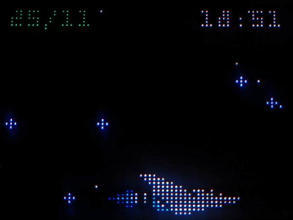
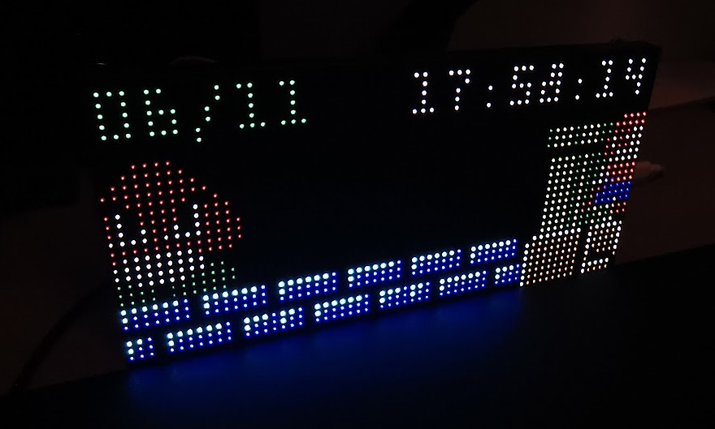

# Matrix Portal M4 MQTT Framework

Simple lightweight MQTT based framework for driving HUB75 LED panels such as AdaFruit's [64x32 HUB75 LED Matrix Panel](https://www.adafruit.com/product/2278) or [64x64 HUB75E LED Matrix Panel](https://www.adafruit.com/product/3649), with the [AdaFruit Matrix Portal M4](https://www.adafruit.com/product/4745) controller board.

#### Video

 

#### Photos

## Requirements

- [AdaFruit Matrix Portal M4](https://www.adafruit.com/product/4745) RGB LED matrix controller
- Any compatible 64x32 pixel HUB75 or 64x64 pixel HUB75E LED matrix panel, such as Adafruit's [64x32 HUB75 LED Matrix Panel](https://www.adafruit.com/product/2278) or [64x64 HUB75E LED Matrix Panel](https://www.adafruit.com/product/3649)
- USB-C (5v/3A) power supply or powered hub
- WiFi access point

## Usage

Create a Python `virtualenv` and install the [CircUp](https://github.com/adafruit/circup) library manager:

    python -m venv ./venv
    source ./venv/bin/activate
    pip install circup

Connect the Matrix Portal M4 to device and confirm USB device is connected and automatically mounted (e.g. `/media/${USER}/CIRCUITPY`):

    ls /dev/ttyACM0
    ls /media/${USER}/CIRCUITPY

Install project dependencies and libraries using `circup`:

    circup install -r ./requirements.txt

To install the project onto the Matrix Portal, you have to copy the main framework (the contents of the `src` directory) to the root of the `CIRCUITPY` filesystem. You will also need to copy the required theme and sprites bitmap that you want to use.

For simplicity, a helper deploy script ([scripts/deploy.sh](./scripts/deploy.sh)) is provided that syncronises the main framework using `rsync` and then copies the required theme files. The deploy script can be used as follows:

    # Installs framework and default ("mario") theme
    scripts/deploy.sh

    # Installs framework and "mario" theme
    scripts/deploy.sh mario

    # Installs framework and "gradius" theme
    scripts/deploy.sh gradius

### Manual Install

Copy the contents of the `src` directory to the root of your Matrix Portal M4 filesystem (e.g. `/media/${USER}/CIRCUITPY`):

    rsync -rv ./src/ /media/${USER}/CIRCUITPY/

Copy the required theme files from the `src/themes` directory to the root of the Matrix Portal M4 filesystem:

    cp src/themes/mario.py /media/${USER}/CIRCUITPY/theme.py
    cp src/themes/mario.bmp /media/${USER}/CIRCUITPY/theme.bmp

Now create a `secrets.py` file in the same location (e.g. `/media/${USER}/CIRCUITPY/secrets.py`). See the included [secrets.py.example](./secrets.py.example) for all possible configuration options and default values.

CircuitPython will automatically restart when files are copied to or changed on the device.
